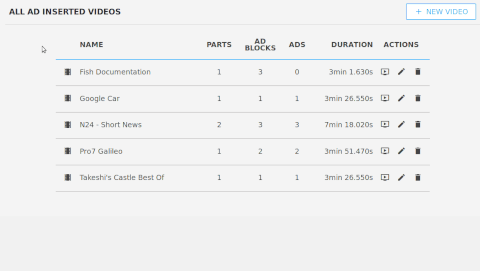
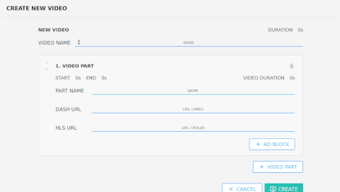
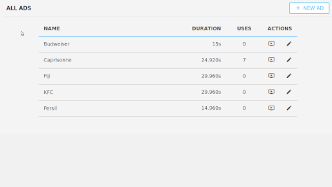
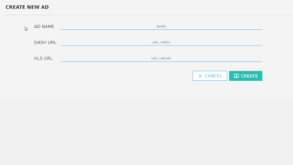

# MPAT-Ad-Insertion-Plugin
Plugin to create ad inserted videos for [MPAT project](http://mpat.eu/).
It depends on the [MPAT-Core plugin](https://github.com/MPAT-eu).

## Requirements

* [MPAT-core](https://github.com/MPAT-eu/MPAT-core#installation)
* [npm](https://docs.npmjs.com/getting-started/installing-node)

## Installation

* Add the plugin to your `MPAT-core/web/app/plugins/` directory:  
  #### Using Composer
  * Add the following code into the `composer.json` of MPAT-core:
    ``` 
    "repositories" : [
        ...
        {
            "type" : "vcs",
            "url" : "git@github.com:Mark-003/MPAT-adinsertion.git"
        },
        ...
    ],
    "require" : {
        ...
        "mpat/mpat-adinsertion": "dev-master",
        ...
    },
    ```
  * change directory to `[path to MPAT-core installation]/MPAT-core/`
  * run `composer update`
  #### Using Git
    * change directory to `[path to MPAT-core installation]/MPAT-core/web/app/plugins/`
    *  run `git clone https://github.com/Mark-003/MPAT-adinsertion.git`
    
* change directory to `[path to MPAT-core installation]/MPAT-core/web/app/plugins/mpat-adinsertion/`
* run `npm install`
* run `npm run build`

##Usage
This Plugin enables you to create ad inserted videos very easily.
* See a full list of all your ad inserted videos.

  
* Create new ad inserted videos.

  
* See a full list of all your ads.

  
* Create new ads.

  